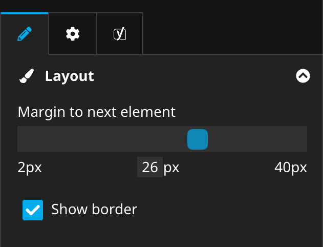

# Numeric range editor for Neos CMS

## Introduction

This package provides a numeric range editor for the Neos CMS UI.
The minimum, maximum and step size can be defined and additionally to make it easier for editors a unit label.

If a certain value should be entered the current value can also be clicked to enter the desired value directly.

## Example

## Installation

Run this in your site package

    composer require --no-update shel/neos-rangeeditor

Then run `composer update` in your project directory.

## How to use

Add a property of type string and configure the editor as seen in this example:

    'My.Site:Content.Text':
      superTypes:
        'Neos.Neos:Content': true
      ui:
        label: 'My text content'
      properties:
        textColor:
          type: string
          ui:
            label: 'Text color'
            reloadIfChanged: true
            inspector:
              group: 'text'
              editor: 'Shel.Neos.RangeEditor/RangeEditor'
              editorOptions:
                min: 0
                max: 100
                step: 5
                unit: 'px'

## Contributions

Contributions are very welcome!

Please create detailed issues and PRs.

## Thx to the sponsor

The initial development of this package was sponsored by [Code Q Web Factory](https://codeq.at/).
